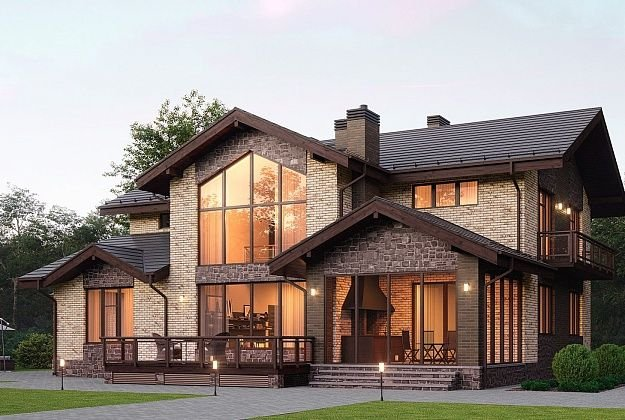
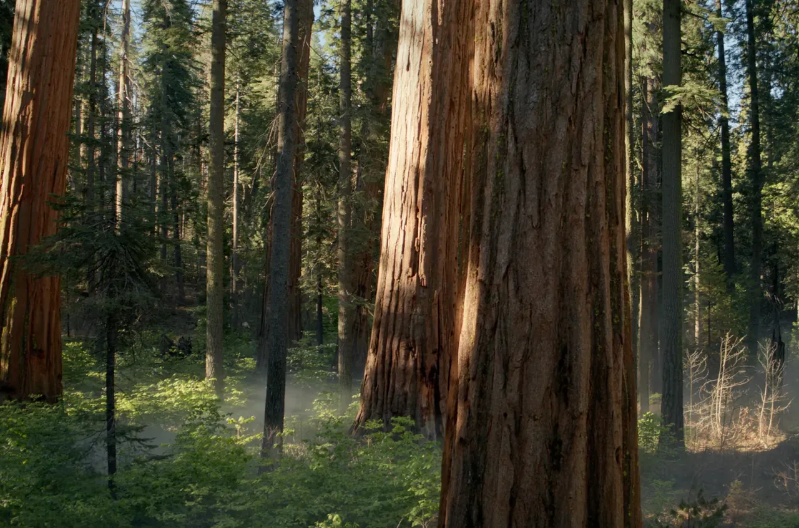
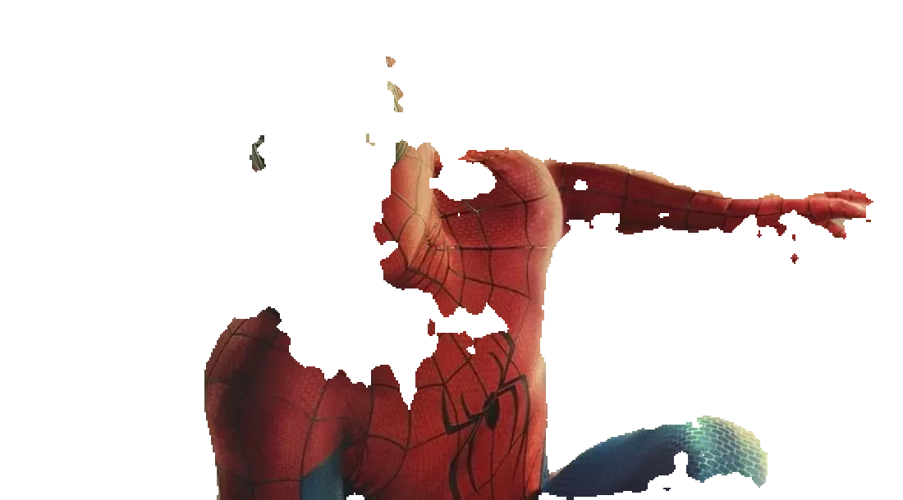
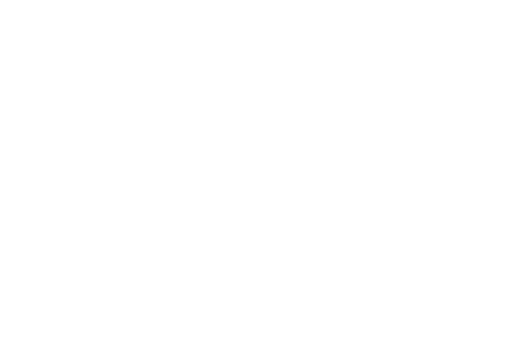
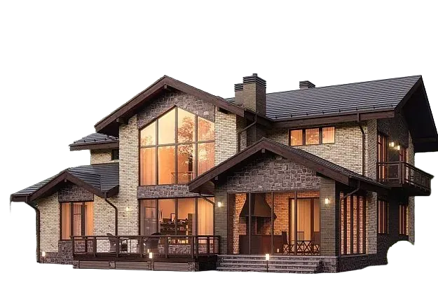
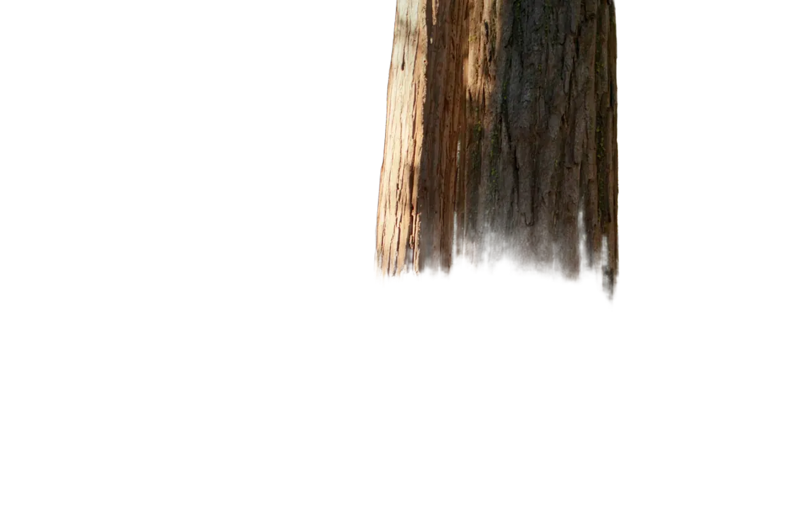
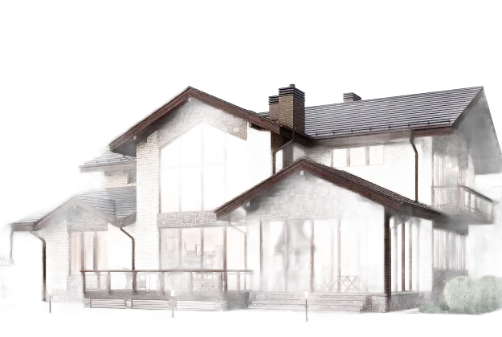
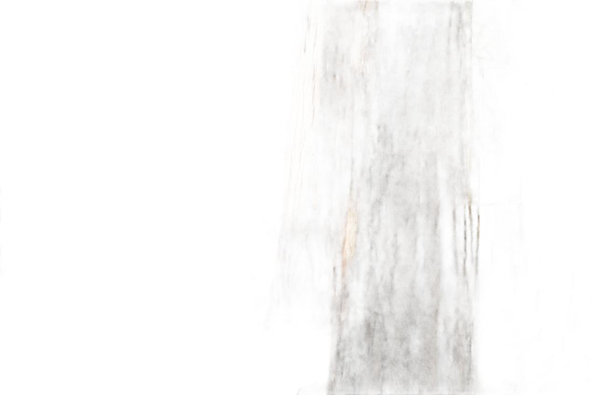

# BG Removal

Веб-сервис для удаления фона.

## Quick start

```bash
python3 -m venv .venv
source .venv/bin/activate
python -m pip install -r requirements.txt
```

Запуск процессов (из корня проекта, с активированным `.venv` в разных терминалах):

```bash
uvicorn bg_remover.app:app --reload --port 8002
uvicorn pipeline.app:app --reload --port 8001
uvicorn web.app:app --reload --port 8000
```

UI: http://127.0.0.1:8000

## Конфиг

Модель задаётся в [`config.yaml`](config.yaml):

```yaml
processor: 'название модели'
# варианты: deeplabv3_mobilenet | deeplabv3plus_resnet101 | birefnet | isnet
```

## Исходные изображения

| #1 | #2 | #3 | #4 |
|:--:|:--:|:--:|:--:|
|  |  |  |  |

Далее будут приведены примеры работы алгоритмов.

## Методы удаления фона

Четыре процессора: DeepLabV3-MobileNet, DeepLabV3+ ResNet-101, BiRefNet, IS-Net.

**DeepLab семейство:** семантическая сегментация Pascal VOC (21 класс). Класс `0` - задний фон. Жёсткая маска.  
Веса: [VainF/DeepLabV3Plus-Pytorch](https://github.com/VainF/DeepLabV3Plus-Pytorch).

**BiRefNet / IS-Net:** dichotomous segmentation (объект vs фон), мягкая alpha.


### DeepLabV3-MobileNet (`deeplabv3_mobilenet`)

**Статья:** Chen et al. — [*Rethinking Atrous Convolution for Semantic Image Segmentation*](https://arxiv.org/abs/1706.05587) (DeepLabV3).  
Бэкбон: MobileNetV2.

**Метрика mIoU на Pascal VOC2012: 0.701**

**Среднее время инференса:** `100 ms` 

**Плюсы**
- быстрый инференс, мало памяти
- простой baseline

**Минусы**
- слабее на границах, чем ResNet / DIS-модели
- только VOC-классы; нет soft alpha

**Примеры**

| #1 | #2 | #3 | #4 |
|:--:|:--:|:--:|:--:|
|  |  |  |  |

### DeepLabV3+ ResNet-101 (`deeplabv3plus_resnet101`)

**Статья:** Chen et al. — [*Encoder-Decoder with Atrous Separable Convolution for Semantic Image Segmentation*](https://arxiv.org/abs/1802.02611) (DeepLabV3+).  
Бэкбон: ResNet-101 + decoder.

**Метрика mIoU на Pascal VOC2012: 0.783**

**Среднее время инференса:**  `240 ms`  

**Плюсы**
- выше mIoU и лучше границы, чем MobileNet
- сильный VOC-сегментатор

**Минусы**
- тяжелее (~14× FLOPs vs MobileNet)
- жёсткая маска, ограничения VOC

**Примеры**

| #1 | #2 | #3 | #4 |
|:--:|:--:|:--:|:--:|
|  |  |  |  |

### BiRefNet (`birefnet`)

**Статья:** Zheng et al. — [*Bilateral Reference for High-Resolution Dichotomous Image Segmentation*](https://arxiv.org/abs/2401.03407) (CAAI AIR 2024).  
HF: [`ZhengPeng7/BiRefNet`](https://huggingface.co/ZhengPeng7/BiRefNet).

**Метрики (статья, DIS-VD):**

| max Fβ | weighted Fβ | MAE ↓ | Sm ↑ | Em ↑ | HCE₅ ↓ |
|--------|-------------|-------|------|------|--------|
| 0.889 | 0.853 | 0.038 | 0.898 | 0.928 | 1006 |

**Среднее время инференса:**  `1500 ms`  

**Плюсы**
- высокое качество cutout / деталей
- мягкая alpha

**Минусы**
- тяжёлый Swin-бэкбон; на CPU медленно
- нужен GPU/MPS + half

**Примеры**

| #1 | #2 | #3 | #4 |
|:--:|:--:|:--:|:--:|
|  |  |  |  |

### IS-Net (`isnet`)

**Статья:** Qin et al. — [*Highly Accurate Dichotomous Image Segmentation*](https://arxiv.org/abs/2203.03041) (ECCV 2022).  
Код: [xuebinqin/DIS](https://github.com/xuebinqin/DIS). Веса: `isnet-general-use.pth` (скачиваются при старте), вход 1024×1024.

**Метрики (статья, DIS-VD, academic IS-Net):**

| max Fβ ↑ | Fwβ ↑ | MAE ↓ | Sm ↑ | Em ↑ | HCE ↓ |
|----------|-------|-------|------|------|-------|
| 0.791 | 0.717 | 0.074 | 0.813 | 0.856 | 1116 |

**Среднее время инференса:**  `230 ms` 

**Плюсы**
- сильный DIS-baseline; мягкая alpha
- проще/легче BiRefNet при сопоставимой задаче cutout

**Минусы**
- качество удаления фона не на людех хуже чем у BiRefNet
- код DIS: Apache-2.0

**Примеры**

| #1 | #2 | #3 | #4 |
|:--:|:--:|:--:|:--:|
|  |  |  |  |

### Сравнение

| | MobileNet | ResNet-101 (V3+) | BiRefNet | IS-Net |
|--|-----------|------------------|----------|--------|
| Статья | [DeepLabV3 (2017)](https://arxiv.org/abs/1706.05587) | [DeepLabV3+ (2018)](https://arxiv.org/abs/1802.02611) | [BiRefNet (2024)](https://arxiv.org/abs/2401.03407) | [DIS / IS-Net (2022)](https://arxiv.org/abs/2203.03041) |
| Маска | жёсткая | жёсткая | мягкая | мягкая |
| Лицензия | MIT | MIT | MIT | Apache-2.0 (код DIS) |
| Инференс (мс) | `100` | `240` | `1500` | `230` |

## Вывод

Среди моделей со свободным использованием, SOTA решением является **BiRefNet**, при этом, если использовать удаление фона только на фотографиях с людьми, лучшей моделью по соотношению качество скорость инференса будет **IS-Net**.